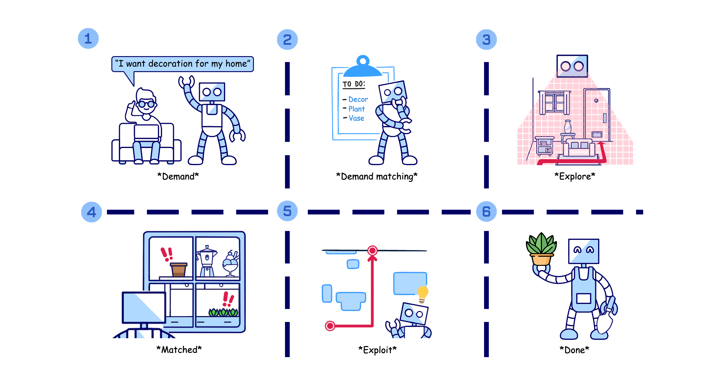

# CogDDN: A Cognitive Demand-Driven Navigation with Decision Optimization and Dual-Process Thinking

## Overview
 
we propose CogDDN, a framework that emulates the human attentional mechanism by selectively focusing on key objects crucial for fulfilling user demands. 

### Training (Under Updating)

### Testing (Under Updating)
## Materials Download (Under Updating)

## Contact
As the paper is currently under blind review, we are unable to provide contact information. We will update accordingly once the review is completed.